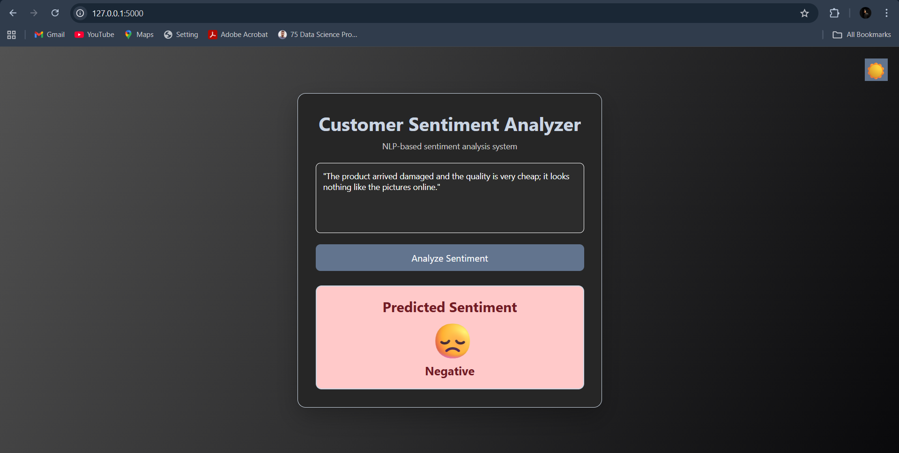
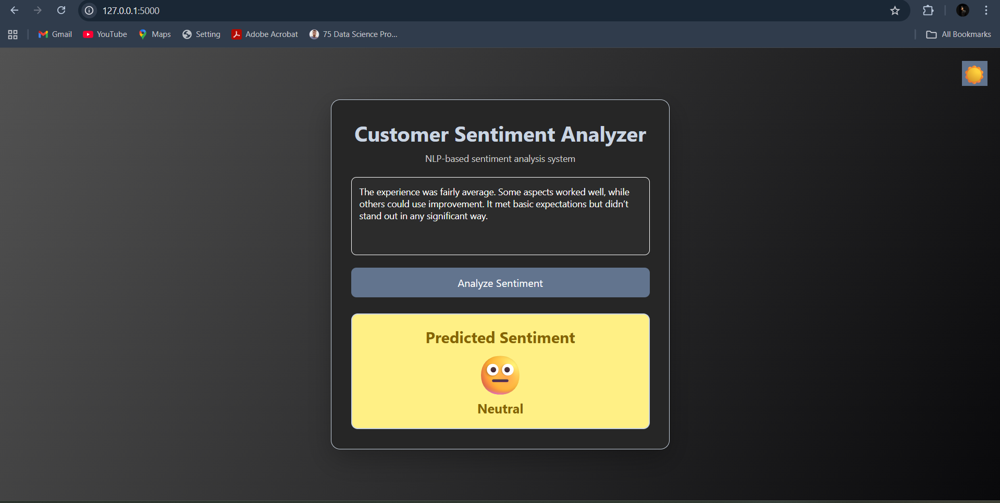

# 📊 Customer Support Sentiment Analysis
## 🔍 Project Overview

This project focuses on analyzing customer support messages to automatically determine their sentiment — Positive, Neutral, or Negative.

Using Natural Language Processing (NLP) techniques and Machine Learning models, the project not only builds a high-performing sentiment classifier but also deploys it as an interactive Flask web application with a modern UI, animations, emojis, and dark mode support.

The goal of this project is to demonstrate:

Strong NLP fundamentals

Model comparison and evaluation

Business-oriented sentiment insights

End-to-end ML deployment

---

## 🧠 Problem Statement

Customer support teams receive a large volume of feedback daily.
Manually analyzing sentiment is:

Time-consuming

Error-prone

Not scalable

This project automates sentiment detection to help businesses:

Identify unhappy customers early

Track sentiment trends across platforms and time

Improve customer experience

---

## 📁 Dataset Description

| Column        | Description                                     |
| ------------- | ----------------------------------------------- |
| Year          | Year of the tweet                               |
| Month         | Month of the tweet                              |
| Day           | Day of the tweet                                |
| Time of Tweet | Categorical time (`morning`, `noon`, `night`)   |
| text          | Customer support message                        |
| sentiment     | Target variable (Positive / Neutral / Negative) |
| Platform      | Platform where the message was posted           |

---

## ⚙️ Technologies Used

🔹 Programming & Libraries

Python

Pandas

NumPy

Scikit-learn

Pickle

🔹 NLP & Machine Learning

TF-IDF Vectorizer

Logistic Regression

Naive Bayes

Support Vector Machine (SVM)

Random Forest

K-Nearest Neighbors (KNN)

GridSearchCV (Hyperparameter Tuning)

🔹 Deployment & UI

Flask

HTML

CSS

JavaScript

🔹 UX Enhancements

Sentiment-based emojis

CSS animations

Dark mode toggle

Responsive modern UI

---

## 🧹 Data Preprocessing

Removed unnecessary noise from text

Handled missing values

Converted categorical labels into consistent sentiment classes

Used only text-based features for model training to maintain NLP purity

---

## 🧠 Feature Engineering: TF-IDF Explained

❓ Why TF-IDF?

Machine learning models cannot understand raw text.
TF-IDF (Term Frequency – Inverse Document Frequency) converts text into meaningful numerical features.

🔍 How TF-IDF Works

Term Frequency (TF)

Measures how often a word appears in a document

Important words appear more frequently

Inverse Document Frequency (IDF)

Penalizes common words like “the”, “is”, “and”

Rewards rare but informative words

## 📌 Why TF-IDF is ideal here

Captures word importance, not just frequency

Reduces impact of common, non-informative words

Works extremely well with linear models like SVM

Lightweight and efficient for deployment

TF-IDF features form the core feature set used by the SVM model.

---

## 🤖 Model Training & Evaluation

📊 Model Performance
| Model                            | F1-Score |
| -------------------------------- | -------- |
| **Support Vector Machine (SVM)** | **0.71** |
| Logistic Regression              | 0.70     |
| Naive Bayes                      | 0.69     |
| Random Forest                    | 0.65     |
| KNN                              | 0.53     |

---

## 🌐 Model Deployment (Flask Web App)

✨ Features of the Web App

Text input for customer messages

Real-time sentiment prediction

🎉 Emoji-based sentiment feedback

🎬 CSS animations for better UX

🌙 Dark mode toggle

Clean and modern UI

---

## 🎨 UI Enhancements

| Sentiment | Visual Indicator   |
| --------- | ------------------ |
| Positive  | 😊 Bouncing emoji  |
| Neutral   | 😐 Fade-in emoji   |
| Negative  | 😞 Shake animation |

---

## 📌 Key Learnings

End-to-end NLP pipeline development

Feature extraction using TF-IDF

Model comparison using F1-Score

Hyperparameter tuning with GridSearchCV

Flask deployment with UX focus

Translating ML outputs into business insights

---

# Flask Webpage (Dark-light mode)

---

---

---
